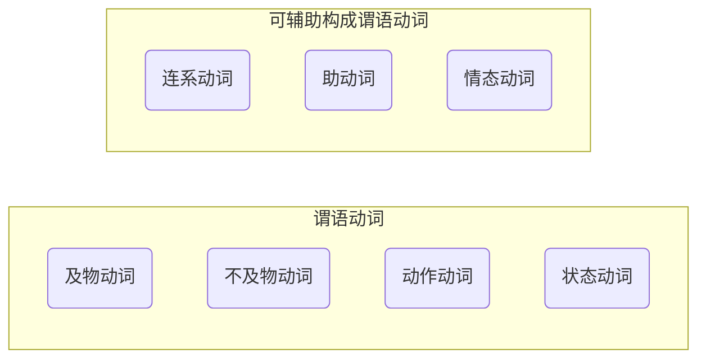

# 实义动词
## 一.按照动作承受者分
- 及物动词
- 不及物动词

## 二.按照动作分
- 动作动词
- 状态动词


一和二可以构成谓语动词
```
一个简单句只能有一个谓语动词。可以表达时体气。

动作的时间

动作的状态

动作的语气

而且其他的动词必须以非谓语动词出现。
```

## 三.非谓语动词
- 不定式
- 过去分词
- 现在分词
- 动名词



## 完全及物动词和不完全及物动词
就是在说是否需要宾语补语。