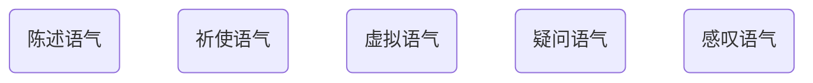

## 一.陈述语气

## 2.祈使语气
命令/请求

去掉“你”，并保持动词原型
```
Rabbit,eat the carrot!
Please,give me a thumbs-up!

You eat the carrot!  ---> Eat the carrot!
You don not eat it! ---> Dont eat it!
You are quiet!--> Be quiet!
You never give up! -->Never give up!
```

## 3.虚拟语气
动词要变位