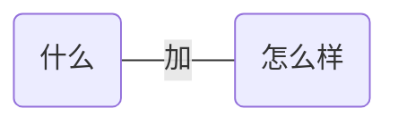

## 总览
绝大部分句子分就两部分：

分别对应了两个最基本的“句子成分”:

几乎所有的英语句子结构都是这个结构
```
主语对应人或物，不管抽象还是具体

怎么样：
广义的“动作/发生什么事”

动作-->语法中的动词：verb
```

# 有哪些动作(动词)？
## 1. 可以独立完成的动作:不及物动词
基本结构：
主语+不及物动词
```
Papa Rabbit sleeps.

没有承受者的动词叫不及物动词
```
## 2. 有一个动作的承受者：及物动词，更形象可称为单及物动词
基本结构: 
主语+单及物动词+宾语
```
Papa Rabbit likes you.
及物动词--->transitive verbs：承受者是宾语--->object
```

## 3. 有两个动作承受者：双及物动词
基本结构: 
主语+双及物动词+间接宾语+直接宾语
```
                    间接宾语:you  直接宾语:English
Papa Rabbit teaches you English.
核心动词是teach,但是教授的知识是英语，而知识的接受对象是你

两个承受者称为:
1.间接宾语  
indirect object
2.直接宾语  
direct object
```

## 4. 只有一个动作承受者(不同2):复杂及物动词
基本结构: 
主语+复杂及物动词+宾语+(宾语)补语
```
                      宾语  补语
Papa Rabbit considers you smart.
--认为你聪明

这样的承受者 必须有个补充承受着的信息 才意义完整

补充的信息在语法上称为补语或补足语：complement
更明确说是宾语补语
```

## 5. 不是个“动作”，表示赋予信息: (连)系动词-->linking verbs
基本结构: 
主语+(连)系动词+(主语)补语
(主语)补语在中国教学中也叫表语:predicative
```
Papa Rabbit is tall.
就是把这个动词之后的信息赋予给前面的主语，这里的 is 就是把tall和主语连在一起，
或则说把后者信息赋予前者


Papa Rabbit is in the room.

Papa Rabbit looks tall.
也算是划等号

Papa Rabbit smells nice.
```

以上几种基本的动词所对应的简单句的类型可以说涵盖了英语的所有句子。
其实就是在说动词和动词需要几个对象才能表达完整意思。
当拆到不能再拆都在说：什么怎么样
什么:主语
怎么样:谓语，谓语都有一个核心动词，叫做谓语动词。


### 关于主谓宾；关于谓语和谓语动词
主谓宾就是对应第二种类别：
主语+单及物动词+宾语

严格来说，谓语和谓语动词是有区别的，
句子主语后面的余下句子部分就是谓语，谓语动词只是谓语的一部分。
```
因为后面还有非谓语动词的概念
```