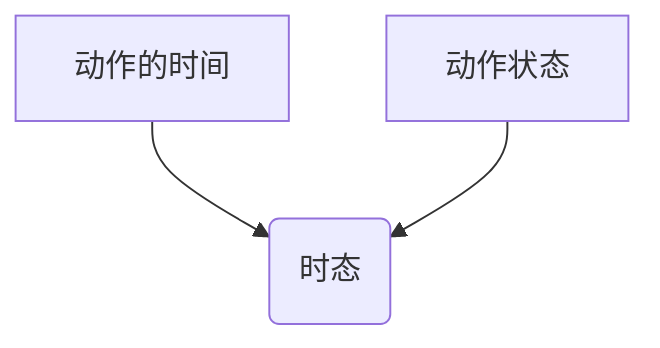
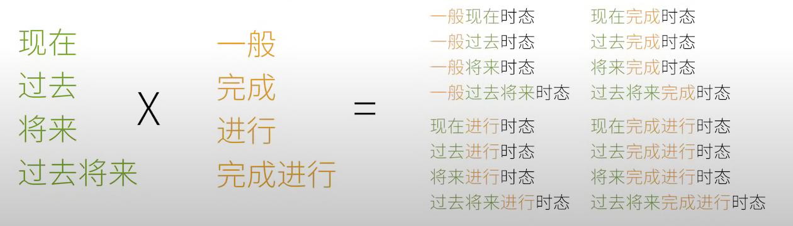
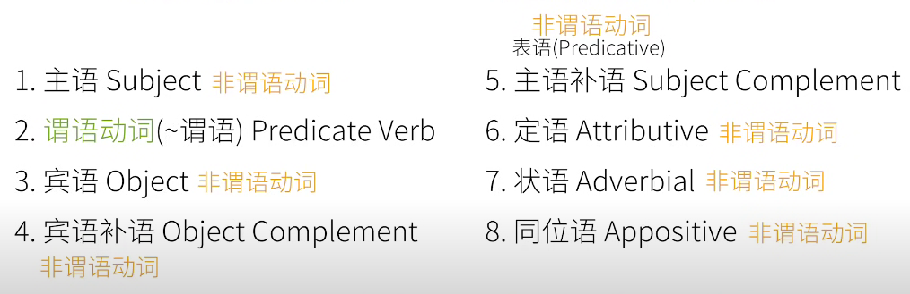

句子成分中最特殊的是谓语动词这一类。
其他句子成分可能是不同词类，
但是谓语动词只能是动词。

## 一.谓语动词三大本领
这些本领中文动词都没有

### 1.表示动作的时间,4种
```
现在
过去
将来
从过去某个时间点“算将来”(过去将来)
```
### 2.表示动作的状态,4种
```
未说明(一般)
完成
进行
不但完成而且继续(完成进行)
```

二者合起来就叫做时态

理论上上的16种可能的时态，也是英语的难点之一


### 3.表示动作的假设，情感等
```
1.虚拟语气
用来表示意愿，和事实相反的假设等
If I ware a rabbit ...

2.陈述语气

I ate a carrot and ...
2.祈使语气
Eat this carrot and ..
```

## 二.谓语动词也需要帮助:助动词--->auxiliary verbs
如果谓语动词不能完成三大本领

或则需要其他本领,比如表示否定，可能性，必须性等意思

需要用到另一类经常和动词一起用的词--->助动词
```
have eaten 表示吃过了，完成的状态
is eating 表示正在吃,进行的状态
助动词be
is eaten 表示被吃

can eat 表示有能力吃
might eat 有可能吃
must eat 有义务吃
do not eat 否定，不吃
```

注意：千万别把助动词和它其他的身份（做实义动词）混淆，比如have 表示有的意思，do 表示做某事

## 三.非谓语动词
动词除了充当句子的谓语动词，

还有可能充当：
主语，宾语，宾语补语，主语补语，定语，等...

只不过要把谓语动词修改一下，改成非谓语动词。

不仅如此，非谓语动词几乎可以取代所有的从句,从而简化句子。只不过这样的句子就不再有表示：
动作时间，状态，语态，语气的功能-->即丧失时态，语态，语气本领。


它们是以不同的形式出现在句子中，包括：
- 动词不定式： eg: to eat
- 现在分词：eg: eating
- 动名词：eg: eating
- 过去分词：eg: eaten

麻烦事：
```
不定式长得和谓语动词原型一样，比如句中出现eat,你并不能确定它是谓语动词还是不定式

现在分词和动名词----->和谓语动词的进行状态一样，比如句中出现eating,你并不能确定表示
谓语动词进行中，还是现在分词，或则是动名词

过去分词--->和谓语动词的完成状态一样，比如句中出现eaten,并不能确定是谓语动词完成了，
还是过去分词
```
所以说非谓语动词也是英语语法的一大难点