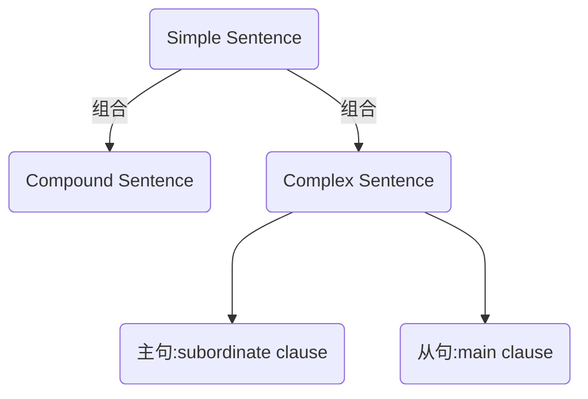
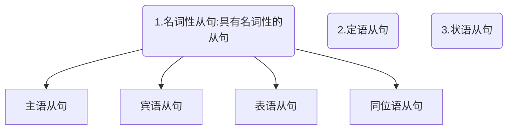

## 一.Parts of Speech
1. 主语:Subject

2. 谓语动词:Predicate Verb

3. 宾语:Object

4. 宾语补语:Object Complement

5. 主语补语:Subject Complement

6. 定语:Attributive
```
主要用来修饰主语或则宾语
The little white rabbit ate a large carrot.

The little white-->主语的定语
a large-->宾语的定语
```

7. 状语 Adverbial
```
用来修饰谓语动词

The rabbit ate quickly.

quickly-->ate 的状语
```

8. 同为语 Appositive
```
把主语或宾语说一遍

Papa Rabbit,an English teacher,eats a carrot.

an English teacher -->就是把Papa Rabbit 用不同方式说一遍，和主语同等地位
```


## 二.简单句的组合

### 2-1.Compound Sentence
句子的简单叠加，是并列关系，直接翻译为复合句，也有书翻译为并列句。


### 2-2.Complex Sentence
Compound Sentence 把一个句子套在另一个句子，甚至一个句子套的一个句子还能再套一个句子，无限套下去。

这是一种从属关系。
称为复杂句。
```
一个句子套另一个句子，在英语语法复杂句分解为：
主句：main clause
从句：subordinate clause

```
### 从句就是把简单句修改一下，来充当另一个句子的句子成分。
这种套娃和中文不同，是英语难点之一。

- 比如修改一个简单句，它就可以充当另一个句子的主语。----->主语从句

- 比如修改一个简单句，它就可以充当另一个句子的宾语。----->宾语从句

- 比如修改一个简单句，它就可以充当另一个句子的主语补语（表语）。---->表语从句


- 比如修改一个简单句，它就可以充当另一个句子的同位语。---->同位语从句
