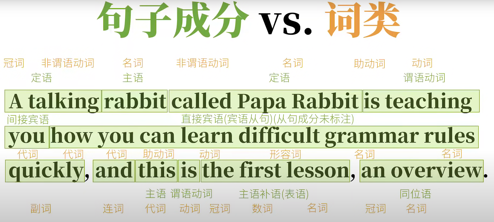

## 词类
两个句子组成方式相同，比如都是主语+谓语动词+宾语，
可是句中包含的词的类型并不一定相同。
```
The rabbit ate a carrot.
He saw something over there.

句型相同但是包含的词不同，也就是说同一类句子成分可能有不同的词类。
```

### 1.名词 Nouns
### 2.冠词 Articles
### 3.代词 Pronouns
### 4.形容词 Adjectives
### 5.数词  Numerals
### 6.副词 Adverbs
```
修饰动词或形容词等等
```
### 7.介词 Prepositions
```
表示和其他词关系的词
I ate two carrots whit chopsticks.
```
### 8.叹词 Interjections
```
Ah,the carrot is tasty.
```
### 9.连词 Conjunctions
```
连接词和句
and 
because
```

### 10.动词 verbs

## 图_句子成分和词类
