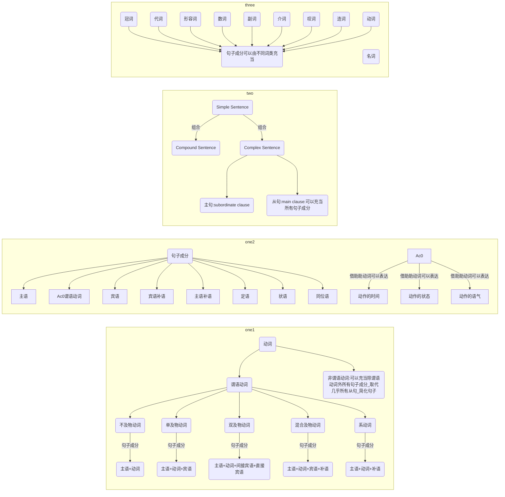

## 英语语法的核心就是动词
动词几乎可以串起所有语法概念

概括下整个英语语法体系：

```mermaid
flowchart RL
    subgraph one1
      A1(动词)
      A1-->A2(谓语动词)
      A1-->A3(非谓语动词:可以充当除谓语动词外所有句子成分_取代几乎所有从句_简化句子)

      A2-->A2A(不及物动词)
      A2-->A2B(单及物动词)
      A2-->A2C(双及物动词)
      A2-->A2D(混合及物动词)
      A2-->A2E(系动词)

      A2A--句子成分-->A2A1(主语+动词)
      A2B--句子成分-->A2B1(主语+动词+宾语)
      A2C--句子成分-->A2C1(主语+动词+间接宾语+直接宾语)
      A2D--句子成分-->A2D1(主语+动词+宾语+补语)
      A2E--句子成分-->A2E1(主语+动词+补语)
    end

    subgraph one2
      Ac(句子成分)
      Ac-->主语
      Ac-->Ac0谓语动词
      Ac-->宾语
      Ac-->宾语补语
      Ac-->主语补语
      Ac-->定语
      Ac-->状语
      Ac-->同位语

      Ac0--借助助动词可以表达-->动作的时间
      Ac0--借助助动词可以表达-->动作的状态
      Ac0--借助助动词可以表达-->动作的语气

    %% Ac1(助动词)
    end

    subgraph two
      B1(Simple Sentence)--组合-->B2A(Compound Sentence)
      B1--组合-->B2B(Complex Sentence)

      B2B--->B2B1(主句:subordinate clause)
      B2B--->B2B2(从句:main clause:可以充当所有句子成分)
    end

    subgraph three
      C1(句子成分可以由不同词类充当)
      Nouns(名词)
      Articles(冠词)-->C1
      Pronouns(代词)-->C1
      Adjectives(形容词)-->C1
      Numerals(数词)-->C1
      Adverbs(副词)-->C1
      Prepositions(介词)-->C1
      Interjections(叹词)-->C1
      Conjunctions(连词)-->C1
      verbs(动词)-->C1
    end
```